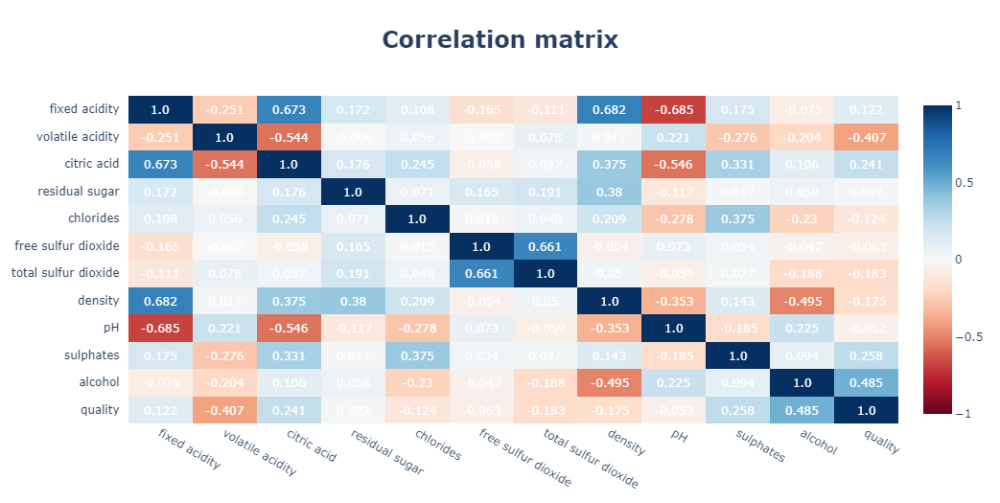
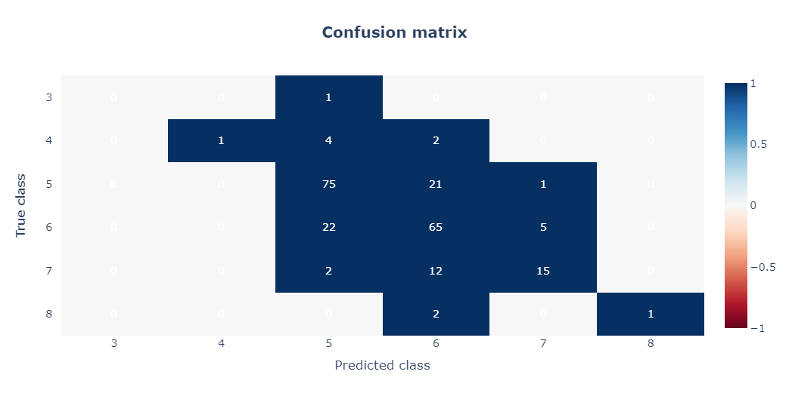

# Vinho Verde

The aim of this project is to estimate the quality of red varieties of Portuguese Vinho Verde wines using the chemical amounts present in them.

## Data

This dataset contains the amounts of chemicals found in red varieties of Portuguese Vinho Verde wine. 

* Id
* Fixed acidity
* Volatile acidity 
* Citric acid
* Residual sugar
* Chlorides
* Free sulfur dioxide 
* Total sulfur dioxide 
* Density
* pH
* Sulphates
* Alcohol
* Quality

## Visual EDA

## Handling imbalanced dataset

The random oversampling method was used to adjust the class distribution of the dataset. This method over-samples the minority classes by picking samples at random with replacement.

## Result

* **The model cannot classify 3rd quality wine correctly.**
* **The model can correctly classify less than 35 percent of 4th and 8th quality wines.**
* **The model can correctly classify almost half of 7th quality wines.**
* **The model can correctly classify more than 70 percent of 5th and 6th quality wines.**

In general, I tried to show what was done in the project. If you want to examine it in more detail, <a href = 'https://www.kaggle.com/code/gokberkyucelkaya/vinho-verde'>you can reach the notebook here.</a>
